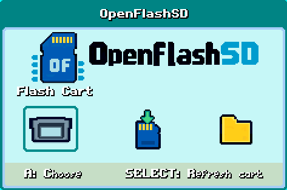
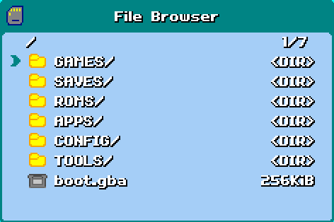
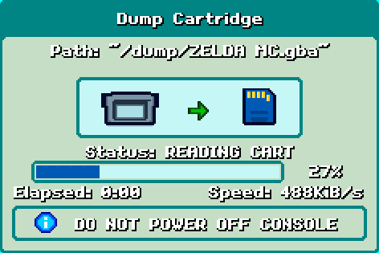
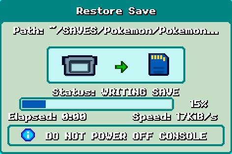
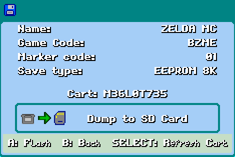
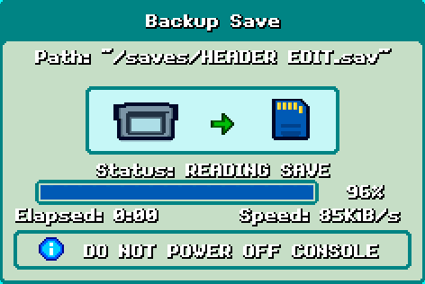
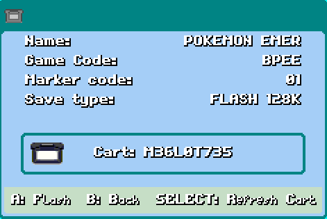
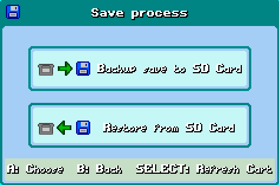

## OpenFlashSD - GBA Cart flasher via SDCard and ESP32

- ### Working GBA frontend/screens side
    - File browser
    - Flashing rom
    - Dump cartridge
    - Backup/restore save

## Pictures

# TODO
- Server side from ESP32
